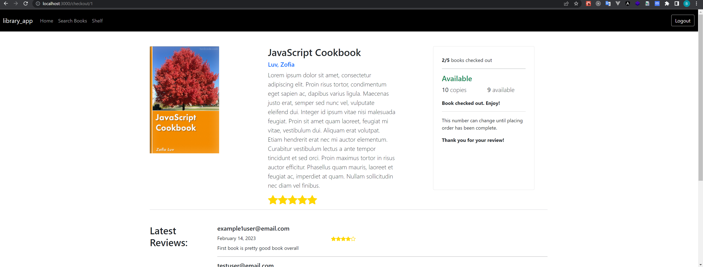

# library_app

## Introduction

This is a library app for user to borrow books, to manage book loans, to leave reviews and to post questions. Other features like online payment, admin service, I would develop them in next phrase.

This is a full stack app. The tech stacks contains TypeScript and React for frontend, Java and Spring (Spring Boot, Spring Security, Spring Data REST and JPA) for backend. I integrated Okta cloud identity solution rather than low-level coding to generate tokens and solve authorization, which is simple use and not vulnerable to security holes.

### The tech stacks

1. Frontend
   
   1. HTML, CSS, Bootstrap 5
   
   2. TypeScript
   
   3. React.js

2. Backend
   
   1. Java
   
   2. SpringBoot
   
   3. Spring Data JPA
   
   4. Spring Data Rest
   
   5. Spring Security

3. Database
   
   1. Mysql

4. Others
   
   1. Okta cloud identity solution
   
   2. Fetch API

### Some demo pictures

#### Home Page

#### Search Page

In this page, user can search books by books' name.

#### Detail Page

In this page, user can check out a book and leave a review.

#### Shelf Page

In this page, user can manage the book loans, such as returning and renewloaning.

#### Q/A Page

In this page, user can post some question to administrator.

